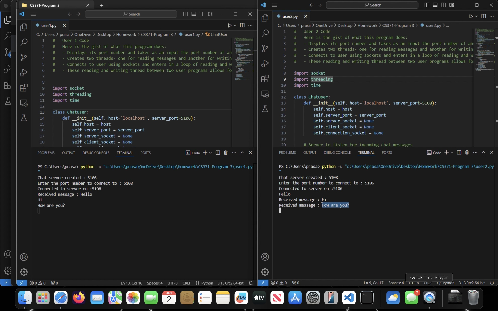

Chat Program

Description: 
This program implements a simple chat program. The program contains one file: program.py. This file is intended to run in same device with different windows for the different users(as it estabishes connection using local port). The program first asks user to set the server port number and the port number of server to which our server wishes to start communication with. Then the program creates two threads: a reading thread and a writing thread. Here is the brief description of what the program does:

- Asks to set the port number of server and take the input of port number of another user
- Connects to user using sockets
- Utilizes threading to enter in a loop of reading and writing message and print it to the screen
- These reading and writing thread between two user programs allows for chatting through sockets

Programming Environment:
This program is written in Python and requires two concurrent instance of the program(n the same device but different window) to work properly. Below is the preview of how the program works:
